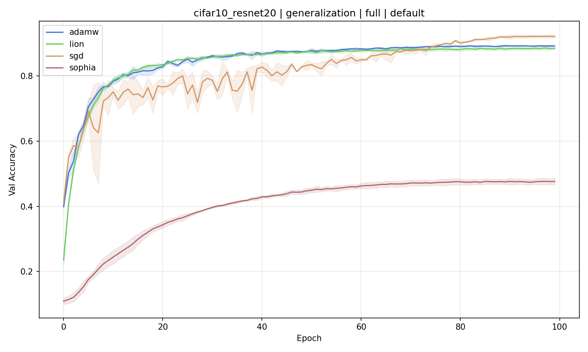
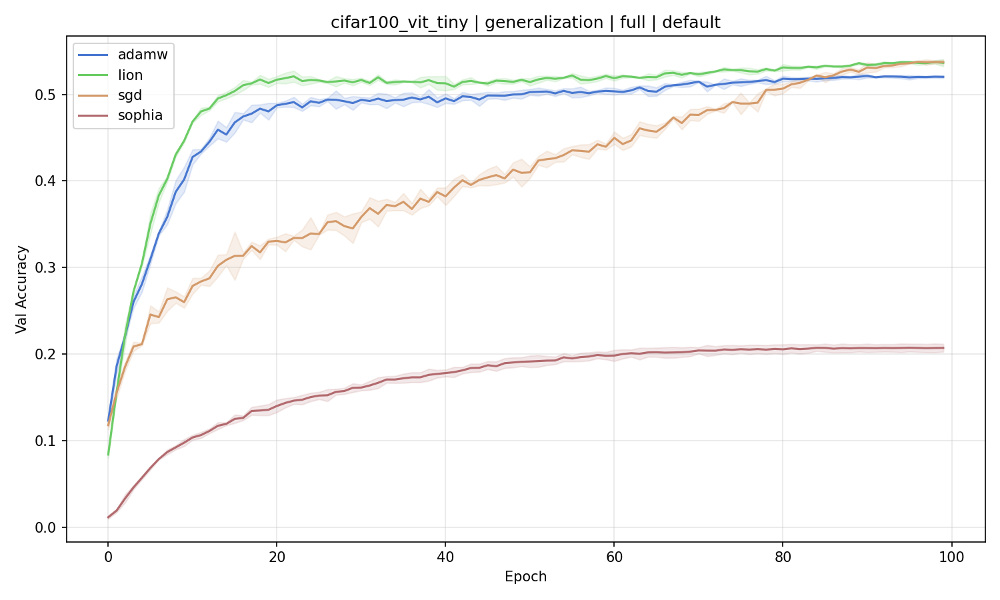

# optim-bench

A small framework for comparing neural network optimizers in PyTorch. Built to answer a simple question: when you swap AdamW for Lion or Sophia, does anything actually change? And if so, how much of the change comes from the optimizer itself, and how much from the surrounding training setup (schedulers, augmentation, learning rate tuning)?

The framework compares two built-in optimizers (AdamW, SGD with momentum) against two external ones (Lion and Sophia, via `pytorch-optimizer`), on two image classification tasks: ResNet-20 on CIFAR-10 (~0.27M params) and ViT-Tiny on CIFAR-100 (~1M params). Adding a new optimizer or task is a one-line decorator.

## Setup

```bash
uv sync
```

## Usage

```bash
optim-bench list                                                # show available tasks/optimizers
optim-bench run cifar10_resnet20 adamw --mode generalization    # single experiment
optim-bench sweep cifar10_resnet20 adamw --variant raw          # LR sweep (5 log-scale values)
optim-bench run-pipeline --device cuda                          # everything: sweeps, full runs, plots
optim-bench compare                                             # regenerate plots from results/
```

Each experiment is defined by three choices. The mode is either `generalization`, which uses the standard train/test split and tracks validation accuracy, or `optimization`, which throws train and test together and just minimizes training loss. The variant is either `raw`, with a constant learning rate and no augmentation (so any differences come from the optimizer itself), or `full`, with cosine annealing, 5-epoch linear warmup, and standard CIFAR augmentation. Finally, the HP setting picks between `default` (the values recommended in each optimizer's paper) and `optimized` (the best learning rate found by sweeping five log-spaced values).

## Results

The full benchmark consists of 192 main runs plus 80 sweep runs, all at 100 epochs, repeated across 3 seeds. Everything ran on an NVIDIA DGX Spark (GB10 with 120 GB unified memory) in roughly three days.

Generalization, validation accuracy (mean of 3 seeds, last epoch):

| Optimizer | CIFAR-10/ResNet-20 (full, default) | CIFAR-100/ViT-Tiny (full, default) |
|-----------|------------------------------------|------------------------------------|
| AdamW     | 0.8924 | 0.5203 |
| SGD       | 0.9211 | 0.5374 |
| Lion      | 0.8849 | 0.5365 |
| Sophia    | 0.4766 | 0.2072 |

Validation accuracy curves for the `full default` variant. On CIFAR-10/ResNet-20 the four optimizers cluster tightly except for Sophia, which plateaus much lower:



On CIFAR-100/ViT-Tiny the gap between Sophia and the rest is even larger, while AdamW, SGD, and Lion are nearly indistinguishable:



Optimization mode, training loss (mean of 3 seeds, last epoch):

| Optimizer | CIFAR-10 (full) | CIFAR-100 (full) |
|-----------|-----------------|-------------------|
| AdamW     | 0.046 | 0.005 |
| SGD       | 0.044 | 1.085 |
| Lion      | 0.050 | 0.004 |
| Sophia    | 1.410 | 3.210 |

A few things stood out. There is no universal winner: with a proper scheduler and augmentation, AdamW, SGD, and Lion land within 0.5-3 percentage points of each other, which matches the conclusion from Schmidt et al.'s "Descending through a Crowded Valley". SGD generalizes best on ResNet despite the highest training loss, which is what the implicit regularization literature would predict. Lion roughly matches AdamW on the Transformer task while using half the optimizer memory. Sophia underperforms on both tasks; it was tuned for LLM pretraining, not small vision models, and pays 26-56% more time per epoch for its Hessian estimation. The single-seed LR sweep turned out to be a bad idea: in 13 out of 16 generalization configurations the "optimized" learning rate ended up worse at epoch 100 than the paper default, because picking the LR from one seed's final accuracy is easy to overfit.

## Tests

```bash
uv run pytest tests/ -v
```
